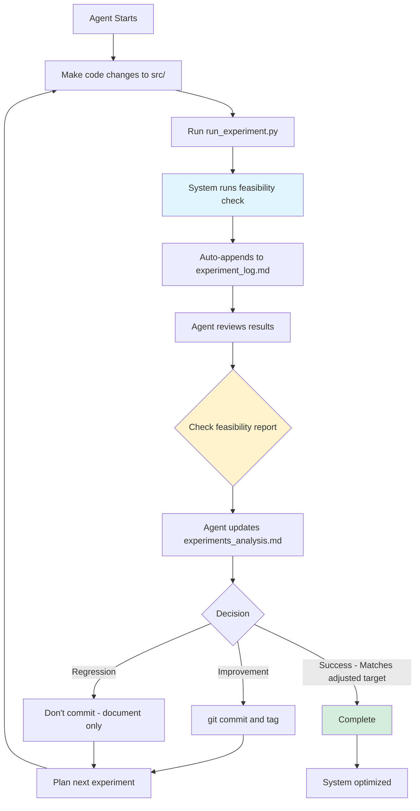

# Overlord: BSC Scheduler Agent Orchestration System

## What This Document Does

Instructs agents how to autonomously optimize the BSC Scheduler by:
- Running tests to evaluate code quality
- Tracking results and learning from them
- Using Git to version experiments and enable rollback
- Making intelligent decisions about next steps

## Your Job

**Goal:** Achieve the highest possible fitness score by getting as close to 0/0 coverage as possible (0 unmatched groups, 0 unassigned members).

**Important:** If the feasibility check identifies impossible groups/members, your goal adjusts automatically. For example:
- If 1 group is impossible: Adjusted target becomes 1/0 (not 0/0)
- The scoring system accounts for this - a 1/0 schedule with 1 impossible group scores the same as 0/0
- Always check the feasibility report in results to know your adjusted target

**Reference:** See [spec.md](../../spec.md) for complete requirements, priorities, and scoring formula details.

---

## How to Test Your Changes

### The Evaluator: evaluate.py

**What it does:**
- Loads test data (42 HS groups, 68 BSC members from csv_examples/)
- Runs feasibility check to identify impossible groups/members
- Executes 100,000 scheduling simulations
- Scores and ranks top 15 schedules
- Outputs structured JSON with all metrics

**How to use:**
Don't call evaluate.py directly - use run_experiment.py (see below)

### The Test Runner: run_experiment.py

**Single entry point for all experiments:**
```bash
python run_experiment.py \
  --exp-id exp_01 \
  --description "Brief description of what you're testing" \
  --simulations 100000
```

**Parameters:**

| Parameter | Required | Default | Description |
|-----------|----------|---------|-------------|
| `--exp-id` | Yes | - | Unique experiment ID (e.g., exp_07) |
| `--description` | Yes | - | Brief description of what's being tested |
| `--simulations` | No | 100,000 | Number of scheduling simulations |
| `--top-n` | No | 15 | Number of top schedules to return |
| `--tag` | No | False | Create git tag for this experiment |
| `--teacher-csv` | No | csv_examples/TEST_Teachers.csv | Teacher data path |
| `--bsc-csv` | No | csv_examples/TEST_Mems.csv | BSC member data path |

**What it does:**

1. Runs feasibility validation (identifies impossible groups/members)
2. Executes scheduler with specified parameters
3. Scores and ranks schedules (with impossibility adjustment)
4. Saves results to `evaluation_results/results_{exp_id}.json`
5. Auto-appends summary to `agent/experiment_log.md`
6. Returns status (SUCCESS/PARTIAL/FAILED)

### Test Data

- **Location:** `csv_examples/`
- **TEST_Teachers.csv:** 42 high school groups
- **TEST_Mems.csv:** 68 BSC members

### Understanding the Metrics

**Primary Metrics:**
- `unmatched_groups`: High school groups with no mentor (Priority 1 - must be 0 or match impossible count)
- `unassigned_members`: BSC members with no assignment (Priority 2 - must be 0 or match impossible count)
- `fitness_score`: Overall quality (higher = better, ~1,000,000+ = excellent)

**Feasibility Metrics:**
- `impossible_groups`: Groups with zero possible matches (unavoidable)
- `impossible_members`: Members with zero possible matches (unavoidable)
- `adjusted_target`: Realistic goal given impossibilities (e.g., "1/0" if 1 group impossible)

**Success Indicator:** 
- Positive fitness score (900,000+) = Excellent
- Matches adjusted target = Perfect given constraints

---

## How to Read Past Results

### Quick Overview: agent/experiment_log.md

Auto-generated summary of all experiments. Shows:
- Experiment ID, timestamp, description
- Git commit hash
- Feasibility check results (impossible groups/members)
- Configuration (simulations, etc.)
- Best schedule metrics only (Rank #1)
- Top 5 summary table
- Status (SUCCESS/PARTIAL/IN PROGRESS)

**Use this to:** Spot trends, compare experiments, find best performers

### Detailed Analysis: agent/experiments_analysis.md

Manual learning log written by agents. Shows:
- What was tried and why (description)
- Technical changes made
- Feasibility report (impossibilities)
- Top 5 summary
- Assessment: What worked, what didn't, why

**Use this to:** Understand reasoning, learn from past decisions, avoid repeating mistakes

### Full Data: evaluation_results/results_exp_XX.json

Complete results including:
- All 15 schedules with full metrics
- Detailed assignments for sampled schedules
- Feasibility report with list of impossible groups/members
- Metadata

**Use this to:** Deep dive into specific experiments, extract specific data

---

## Git Workflow

### The Complete Workflow

1. **Make code changes** (edit src/solver.py, src/scorer.py, etc.)
2. **Run experiment** (`python run_experiment.py --exp-id exp_XX ...`)
3. **Review results** (check agent/experiment_log.md and JSON)
4. **Update analysis** (manually edit agent/experiments_analysis.md)
5. **Decide:**
   - If improvement or valuable learning: Commit and tag
   - If regression or not useful: Don't commit (but keep analysis entry)

### Git Commands

**Create commit and tag (only if keeping changes):**
```bash
git add -A
git commit -m "Exp XX: Brief description"
git tag exp_XX
```

**Useful commands:**
```bash
# List all experiments
git tag -l "exp_*"

# Restore previous experiment
git checkout exp_05

# Return to latest
git checkout main

# Compare experiments
git diff exp_04 exp_05 -- src/

# Delete tag (if needed)
git tag -d exp_XX
```

### Why This Workflow?

- **Analysis before commit:** Even failed experiments teach us something - document them
- **Selective commits:** Only version control changes worth keeping
- **Full history:** All experiments (success or failure) documented in experiments_analysis.md
- **Easy rollback:** If current state regresses, revert to any tagged experiment

---

## Agent Workflow

### Complete Cycle

**1. Run Test**
```bash
python run_experiment.py --exp-id exp_XX --description "..." --simulations 100000
```

**2. Results Auto-Logged**
- System automatically appends to agent/experiment_log.md
- JSON saved to evaluation_results/

**3. Review Results**
- Check agent/experiment_log.md for latest entry
- Note fitness score, unmatched/unassigned counts
- **Check feasibility report** - are there impossibilities?
- Compare to adjusted target (not just 0/0)

**4. Update experiments_analysis.md**
- Manually write entry (even if experiment failed)
- Include: description, changes made, top 5 summary, assessment
- Document what you learned and why results turned out this way

**5. Make Decision**
- **Improvement:** Fitness increased or moved closer to adjusted target → Commit and tag
- **Regression:** Fitness decreased or moved away from goal → Don't commit, try different approach
- **Lateral:** Mixed results → Use judgment based on priorities (spec.md)
- **Learning:** Even if not committing, update analysis with insights

**6. Continue Planning**
- Based on assessment, plan next experiment
- Reference past experiments in experiments_analysis.md for ideas

### Example Decision Logic

**Scenario A: Clear Improvement**
- Previous best: 1/2, fitness 600,000
- New result: 0/1, fitness 850,000
- Decision: COMMIT - moved closer to goal on both priorities

**Scenario B: Regression**
- Previous best: 0/0, fitness 1,001,500
- New result: 1/0, fitness 1,200
- Decision: DON'T COMMIT - Priority 1 got worse (unmatched increased)
- Action: Document in analysis what went wrong, revert code

**Scenario C: Impossible Case Success**
- Feasibility: 1 group impossible, adjusted target = 1/0
- Result: 1/0, fitness 1,001,300
- Decision: COMMIT - achieved adjusted target (perfect given constraints)

### Status Indicators

When reviewing experiment_log.md:
- ✓ = Achieved (0 is good for unmatched/unassigned, or matches impossible count)
- ✗ = Not achieved
- Positive fitness (~1M+) = Excellent (achieved adjusted target with good distribution)
- Small positive (~1-10k) = Good (achieved adjusted target, some size penalties)
- Negative = Has unmatched/unassigned beyond impossibilities

---

## Overall Workflow Example

### Agent thinks:
"Current best is exp_06 with 0/0 coverage but fitness only 800,000 due to lots of solo teams. I want to try weighted randomization to improve team sizes while keeping 0/0."

### Agent executes:

**1. Make changes**
```python
# Edit src/solver.py
# Modify _determine_team_size() to prefer pairs with 70% probability
```

**2. Run experiment**
```bash
python run_experiment.py \
  --exp-id exp_07 \
  --description "Weighted random team size selection: 70% prefer pairs" \
  --simulations 100000
```

**3. System auto-logs to experiment_log.md**
```
Feasibility Check:
- Impossible groups: 0
- Adjusted target: 0/0

Best Schedule:
- Fitness: 1,002,100
- Unmatched: 0 ✓, Unassigned: 0 ✓
- Teams: 8 solo, 32 pairs, 3 trios
- Status: ✓ SUCCESS
```

**4. Agent reviews**
- Fitness improved from 800k to 1,002k ✓
- Still 0/0 coverage ✓
- Solo teams reduced from 15 to 8 ✓
- This is an improvement!

**5. Agent updates experiments_analysis.md**
```markdown
## Experiment exp_07 - 2026-02-10 15:30 - abc1234 (tag: exp_07)

**Description:** Applied weighted randomization to team size selection to reduce solo teams 
while maintaining 0/0 coverage. Previous approach (exp_06) achieved 0/0 but had 15 solo teams.

**Changes Made:**
- src/solver.py: Modified _determine_team_size() to use 70/30 weighted probability favoring 
  pairs over solos when both are valid

**Configuration:**
- Simulations: 100,000

**Status:** Completed

**Results:** `evaluation_results/results_exp_07.json`

**Key Metrics:**
- Impossible groups: 0
- Impossible members: 0
- Adjusted target: 0/0
- Best schedule: 0/0 coverage, fitness 1,002,100

**Top 5 Summary:**
| Rank | Fitness   | Unmatched | Unassigned | Teams 1/2/3/4+ |
|------|-----------|-----------|------------|----------------|
| #1   | 1,002,100 | 0         | 0          | 8/32/3/0       |
| #2   | 1,001,850 | 0         | 0          | 10/30/3/0      |
| #3   | 1,001,600 | 0         | 0          | 9/31/2/0       |
| #4   | 1,001,400 | 0         | 0          | 11/29/3/0      |
| #5   | 1,001,200 | 0         | 0          | 12/28/2/0      |

**Assessment:** Significant improvement. Weighted randomization successfully reduced solo teams 
from 15 to 8 while maintaining perfect 0/0 coverage. Fitness jumped from 800k to 1M+. This 
strategy is working - keep this change and use as new baseline.
```

**6. Agent commits**
```bash
git add -A
git commit -m "Exp 07: Weighted random team size selection (70% pairs)"
git tag exp_07
```

**7. Agent continues**
"exp_07 is now the best. Next, I'll try combining this with enhanced backfill to see if I can get even better distribution..."

---

## Quick Reference

**Key Files:**
- [spec.md](../../spec.md) - Success criteria, priorities, scoring
- `run_experiment.py` - Run experiments
- `agent/experiment_log.md` - Auto-generated summary
- `agent/experiments_analysis.md` - Manual learning log
- `evaluation_results/*.json` - Full experiment data

**Workflow:**
Code → Run → Review → Analyze → Decide (commit or not) → Continue

**Goal:**
Match adjusted target (check feasibility report in results)
Maximize fitness score

**Decision Rules:**
- Improvement on Priority 1 (unmatched groups): KEEP
- Improvement on Priority 2 (unassigned members): Usually KEEP
- Regression on Priority 1: REVERT
- Achieved adjusted target: Likely KEEP (depends on fitness)

---

## Visual Workflow Diagram



---

## Notes on Feasibility Checking

The system automatically validates whether all groups and members can be matched before running simulations:

**What it checks:**
- For each HS group: Does at least ONE BSC member have overlapping availability?
- For each BSC member: Does at least ONE HS group have overlapping availability?

**If impossibilities are found:**
- They are reported in all outputs (JSON, experiment_log, analysis)
- The scoring system adjusts automatically (no penalty for unavoidable unmatches)
- The adjusted target becomes your goal (e.g., 1/0 instead of 0/0)

**Example:**
If Rudder HS has no time overlap with any BSC member:
- Feasibility report: 1 impossible group
- Adjusted target: 1/0
- A schedule with 1 unmatched (that impossible group) scores the same as 0/0
- Agent knows: "I achieved the best possible result given the data"

This prevents agents from trying to optimize impossible cases and provides clear expectations.
